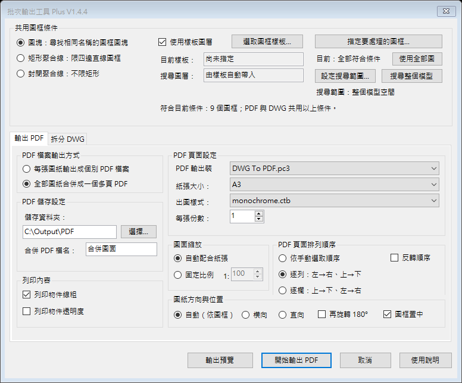
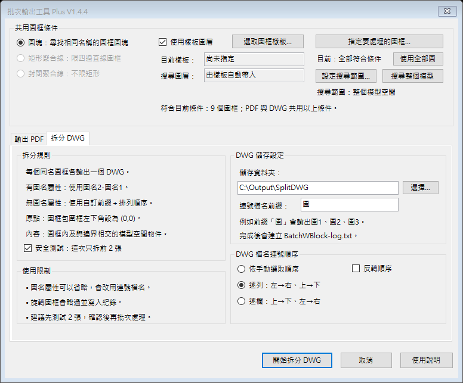

# BatchPlotPlus 1.5.3

**1.5.3：框到的物件直接輸出。** 依使用者最新要求，移除 1.5.2 的跨圖紙阻擋及其他圖框排除。DWG 矩形／封閉聚合線模式仍使用 WB 交叉選取；每個邊界各一檔，框到的完整物件都保留，不裁切跨框線段或圖塊。PDF 與共用輸出邏輯維持 1.4.4 基準。尚未發布 Release。

使用方式及驗證界線見 [1.5.3 拆圖說明](docs/dwg-split-1.5.3.md)。[1.5.2 紀錄](docs/dwg-split-1.5.2.md) 的跨圖紙阻擋已取消，不適用目前版本。

1.5.3 已完成 AutoCAD 2023 拆圖與輸出檔回讀測試，使用者亦確認可用。PDF 核心／共用邏輯比對及自動檢查通過，本版未新增 PDF 實際列印驗收。取得本版請使用目前原始碼與 `BuildRelease.ps1` 建置；下方 1.5.0 安裝包是舊版。

<details>
<summary>1.5.0–1.5.1 歷史下載與驗證紀錄</summary>

**1.5.1 行為還原：** 批次 PDF、DWG 拆圖與共用輸出邏輯已完整還原至 1.4.4 基準，保留字型管理。後續出圖／拆圖只做 GUI／UIUX 優化，功能改動須另行確認。見 [還原說明](docs/restore-1.5.1.md) 與 [功能基準政策](docs/output-behavior-policy.md)。1.5.1 尚未發布 Release；以下 1.5.0 下載及修復紀錄為歷史版本，並非本次還原版。

BatchPlotPlus 是整合批次 PDF、DWG 拆圖與字型管理的 AutoCAD 繁體中文外掛。**1.5.0 已發布**，沿用原專案、產品識別與指令，適用範圍以 Windows 64 位元 AutoCAD 為目標。

**[下載 1.5.0 安裝包](https://github.com/NicheSam/BatchPlotPlus/releases/download/v1.5.0/BatchPlotPlus-1.5.0-installer.zip)** · [發行說明](https://github.com/NicheSam/BatchPlotPlus/releases/tag/v1.5.0) · [SHA256](https://github.com/NicheSam/BatchPlotPlus/releases/download/v1.5.0/BatchPlotPlus-1.5.0-SHA256.txt)

AutoCAD 2023 已通過下列桌面測試；2021–2024 及 2025 原版至 Update 1.3 已核對官方 API／執行環境基準。其他年版尚無實機驗收，2025 Update 1.4 起的 .NET 10 宿主相容性仍待核實。

## 1.5.0 新增與修復

- 原 Ribbon 新增一個「字型管理」按鈕（`BATCHFONTS`），需要時才開啟狀態、紀錄、啟停與快取管理。
- 整合缺失 SHX 大字體替代模組，移除固定年份與語系路徑，保留自有替代檔紀錄。
- 修復 PDF 份數參數、設定還原及讀回、列印資源釋放、Windows 保留檔名與拆圖座標處理。
- 已通過雙框架建置、每框架 74 項邏輯檢查、安裝包檢查及兩張真實 DWG 的字型核心測試。
- AutoCAD 2023 已完成正式 DLL 自動載入、字型 GUI、兩頁 PDF、成功／失敗參數還原與字型掃描驗證；拆圖、首次開圖及其他年版實機仍待驗收。

詳細範圍與遷移方式見 [1.5 升級紀錄](docs/upgrade-1.5.md)，版本矩陣與其他驗證邊界見 [官方文件核對](docs/official-validation-1.5.md)。[1.5.0 Release 與安裝包](https://github.com/NicheSam/BatchPlotPlus/releases/tag/v1.5.0) 已發布；一般 Release 標記不代表所有環境已驗收，下方 1.4.4 截圖及歷史驗證保留作為既有版本紀錄。

它把「批次輸出多頁 PDF」與「依圖框拆分 DWG」整合在同一個視窗與 Ribbon 頁籤，並以不儲存來源圖面變更為原則執行暫時性出圖處理。

</details>

<details>
<summary>歷史介面截圖（1.4.4，未包含 1.5 字型管理）</summary>





</details>

## 主要功能

- 依同名圖框、矩形聚合線或封閉聚合線尋找圖紙範圍。
- 將全部圖框輸出為一份多頁 PDF，或分別輸出單頁 PDF。
- 自動符合紙張、置中，並可選擇自動、橫向或直向紙張方向。
- 出圖樣式之外，可獨立開啟或關閉物件線粗與透明度列印。
- 依目前 DWG 模式限制出圖樣式：CTB 圖面只顯示 CTB，STB 圖面只顯示 STB。
- 使用 `monochrome` 時，在未提交的 AutoCAD transaction 中暫時處理 True Color／命名樣式顏色，出圖後回復。
- 依圖框批次拆分 DWG，並提供先測試前 2 張的安全選項。
- 自動載入「批次輸出工具」Ribbon 頁籤。
- 字型管理可啟停缺失 SHX 大字體替代、查閱紀錄與清理本工具自有快取；不修改來源 DWG 字型樣式。

<details>
<summary>1.4.x 歷史更新紀錄</summary>

## 1.4.4 更新

- 修正「輸出預覽」在自動配合紙張時看起來過小的問題；預覽圖框現在貼近可列印區域，較接近實際出圖比例。
- 預覽線稿會讀取 AutoCAD 物件／圖層顏色，並依 `monochrome`／`grayscale` 出圖樣式轉成黑色或灰階。
- 有圖面內容時不再疊加示意標題欄與長邊箭頭，避免遮住實際線稿。
- 新增預覽比例、色彩與內容接線的 UI contract 檢查。

## 1.4.3 更新

- 新增「列印物件線粗」與「列印物件透明度」開關，並直接對應 AutoCAD 出圖設定。
- 新增自動、橫向、直向三種圖紙方向，保留另外旋轉 180° 與圖框置中。
- PDF 與 DWG 排序狀態已分離，切換頁籤不會互相覆寫。
- 安裝器改為 PowerShell 主體、BAT 入口，修正括號、`&`、中文與 `!` 路徑解析、UAC 等待與退出碼傳遞。
- 改部署到 `%ProgramData%\Autodesk\ApplicationPlugins`，並在備份後清除指向舊路徑的 Loader 登錄。
- 安裝成功僅代表靜態部署驗證通過；AutoCAD 執行期載入需由 `BATCHPLOTDIAG` 再確認。

> 版本號依專案要求收斂為 1.4.3；本版取代之前標示為 1.4.21 的安裝包。

## 1.4.21 更新

- 安裝程式會逐一解除並檢查來源、暫存及部署後 bundle 內所有檔案的 `Zone.Identifier`。
- 任一檔案無法解除封鎖或仍保留下載封鎖標記時，安裝立即失敗，不再只顯示警告或回報部署成功。
- 部署後封鎖檢查或 DLL 完整性檢查失敗時，會移除無效的新版本並嘗試還原舊版。
- 安裝診斷改為掃描 bundle 內全部檔案；任何被封鎖檔案均列為失敗。

## 1.4.2 更新

- 修正部分電腦安裝後沒有 Ribbon 頁籤、按鈕與指令的問題。
- 安裝位置改為 AutoCAD 隱含信任的 `%ProgramFiles%\Autodesk\ApplicationPlugins`，安裝程式會自動要求系統管理員權限。
- 修正 bundle 的啟動載入與指令觸發載入設定；即使 Ribbon 初始化失敗，備用指令仍可使用。
- 新增 `BATCHPLOTDIAG` 執行期診斷指令，以及 `DiagnoseInstallation.bat` 一鍵安裝診斷報告。
- 安裝時會解除下載檔案封鎖，並移除同名的舊版使用者／共用安裝，避免 AutoCAD 載入錯誤副本。

完整版本紀錄請見 [CHANGELOG.md](CHANGELOG.md)。

## 1.4.1 更新

- 有完整「圖名1／圖名2」屬性時，繼續使用 圖名2-圖名1 命名。
- 圖框屬性不足或沒有屬性時，可使用自訂前綴和排序後連號，例如 圖1.dwg、圖2.dwg、圖3.dwg。
- DWG 頁籤可獨立設定手動選取、逐列、逐欄及反轉順序。

</details>

## 安裝

一般使用者安裝 1.5.0 不需要 Visual Studio 或 .NET SDK：

1. 從 [GitHub Releases](https://github.com/NicheSam/BatchPlotPlus/releases/tag/v1.5.0) 下載 `BatchPlotPlus-1.5.0-installer.zip`。
2. 解壓縮全部內容。
3. 完整關閉 AutoCAD。
4. 雙擊 `InstallOrUpdate.bat`。
5. 重新開啟 AutoCAD，使用「批次輸出工具」頁籤。

若要自行建置，請依下方「建置」產生 `release/BatchPlotPlus-1.5.0-installer.zip`。安裝前請保存工作並關閉 AutoCAD。安裝器會備份並遷移已辨識的舊獨立 CadFontAuto；舊 FontFallbacks 替代檔仍保留。

備用指令：

| 指令 | 功能 |
| --- | --- |
| `BATCHPLOTPLUS` | 開啟上次使用的功能頁面 |
| `BATCHPDF` | 開啟 PDF 輸出頁面 |
| `BATCHWB` | 開啟 DWG 拆分頁面 |
| `BATCHPLOTDIAG` | 顯示目前載入的 DLL、版本及 AutoCAD 載入設定 |
| `BATCHFONTS` | 1.5 新增：開啟字型管理、狀態與替代紀錄 |

部署位置：

```text
%ProgramData%\Autodesk\ApplicationPlugins\BatchPlotPlus.bundle
```

安裝程式不會強制關閉 AutoCAD；若偵測到 AutoCAD 正在執行，會停止部署。若安裝後仍未載入，請先執行解壓縮資料夾內的 `DiagnoseInstallation.bat`，再將桌面產生的診斷報告提供給維護者。

## 建置

需求：

- Windows 10／11 64 位元
- .NET 8 SDK
- Windows 上的 .NET Framework 4.8 targeting pack
- 建置時會從 Autodesk 官方 NuGet 套件取得 AutoCAD 2021 與 2025 API 編譯參考

```powershell
powershell.exe -NoProfile -ExecutionPolicy Bypass -File .\BuildRelease.ps1
```

`BuildRelease.ps1` 會建立 R24 的 .NET Framework 4.8 組件與 R25 的 .NET 8 組件，執行測試與 bundle 驗證，再產生 1.5.0 壓縮檔。2025 Update 1.4 起的宿主相容性仍待核實；建置通過不代表所有年版實機通過。

## 專案結構

```text
BatchPlotPlus.AutoCAD/  AutoCAD .NET 插件原始碼
Bundle/                 ApplicationPlugins bundle manifest 與說明
LogicTests/             不需要 AutoCAD 的純邏輯回歸測試
UiPreview/              離線 WinForms 介面預覽
docs/                   控制項行為與介面用語檢視
tools/                  bundle 與載入驗證工具
ui-preview/             PDF／DWG 頁籤畫面
```

## 驗證狀態

1.5.0 已通過雙框架建置、每框架 74 項邏輯檢查、安裝／UI／bundle 靜態檢查，以及 AutoCAD 2023 桌面載入、字型 GUI、兩頁 PDF 與出圖成功／失敗設定還原。建置有 NU1900 警告，線上套件弱點資料查核未完成。字型掃描與來源 DWG 不變已有證據；實際中文字形、首次開圖及旋轉 UCS 拆圖仍待實測。完整邊界見 [驗證文件](docs/official-validation-1.5.md)。

<details>
<summary>1.4.4 歷史驗證（不作為 1.5.0 驗收結果）</summary>

- `net48` 與 `net8.0-windows` Release 建置：0 warnings、0 errors。
- 37 項純邏輯測試。
- 全域 UI 控制項→狀態→後端消費者契約測試。
- 安裝器在空格、括號、`&`、中文、`!` 五種路徑的非部署沙盒測試。
- 安裝檔缺失時回傳非零退出碼與明確錯誤訊息。
- 安裝位置、manifest 載入旗標、指令宣告與診斷檔封裝契約測試。
- 實際建立 `Zone.Identifier` 的負向測試：未修復時安裝驗證失敗，逐檔解除後無殘留標記。
- R24／R25 bundle 路由、目標框架、DLL 與封裝結構驗證。
- AutoCAD 2023 Core Console 實際 NETLOAD R24 組件。
- PDF／DWG 兩頁繁體中文 WinForms 離線介面回歸。
- AutoCAD CTB 三頁黑白 PDF 測試：三頁彩色像素皆為 0。
- 實際 14 MB DWG 副本單頁輸出：彩色像素為 0。
- 暫時性顏色處理前後物件狀態數量一致，未儲存來源 DWG 變更。

</details>

## 限制與安全注意事項

- 每頁仍由 AutoCAD 原生出圖引擎產生；大量圖框本來就需要逐頁圖形生成時間。
- 缺少 SHX、外部參考或出圖裝置時，應先修復來源圖面的依賴項目。
- DWG 拆分會建立新檔，不應刪除來源物件；第一次使用新圖面時，建議保留「先測試前 2 張」。
- 本 repository 尚未指定開源授權；未經另外授權，不代表可任意重新散布或修改。

## English

Version 1.5.1 restores PDF, DWG splitting and shared output logic to the exact 1.4.4 source baseline while retaining font management. Further output changes are limited to GUI/UX unless separately approved. The 1.5.0 links and changes below describe the previous release; a 1.5.1 Release is not yet published.

BatchPlotPlus 1.5.0 is released for 64-bit Windows AutoCAD, with the compatibility and validation limits below. It retains batch PDF output and DWG splitting, and adds on-demand font management (`BATCHFONTS`) for missing BigFont SHX references. The module uses the host's chineset.shx, keeps an owned cache and does not rewrite source drawing styles. It is not a universal replacement for missing TTF or ordinary SHX fonts.

Version 1.4.4 fixes the output preview scale and color model: fit-to-paper preview now uses a printable-area layout, entity and layer colors are sampled, and monochrome/grayscale plot styles are reflected in the preview. Version 1.4.3 remains the earlier installation and plotting workflow hardening release.

Download `BatchPlotPlus-1.5.0-installer.zip` from the [1.5.0 Release](https://github.com/NicheSam/BatchPlotPlus/releases/tag/v1.5.0), extract it, save your work, close AutoCAD and run `InstallOrUpdate.bat`. Building with `BuildRelease.ps1` remains optional. The installer backs up and migrates the recognized standalone CadFontAuto module while preserving legacy FontFallbacks files. The normal Release designation does not imply all runtime acceptance checks are complete.

Official documentation supports the selected 2021 SDK/.NET Framework 4.8 baseline for AutoCAD 2021–2024 and the 2025 SDK/.NET 8 baseline through AutoCAD 2025 Update 1.3. Autodesk now lists .NET 10 for Update 1.4 onward; that host combination remains unverified. AutoCAD 2023 desktop loading, the font form, two-page PDF output and setting restoration passed. Other hosts, rotated-UCS splitting, first-open behavior and representative Chinese glyph appearance still need runtime acceptance. See the [upgrade record](docs/upgrade-1.5.md) and [official documentation review](docs/official-validation-1.5.md).
