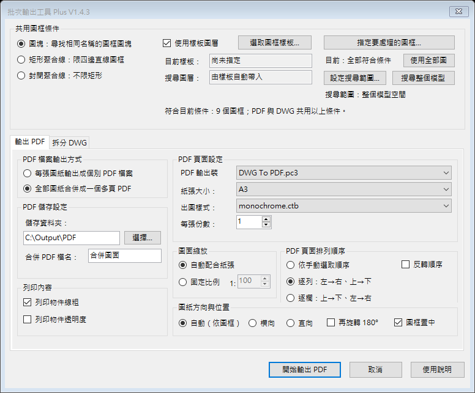
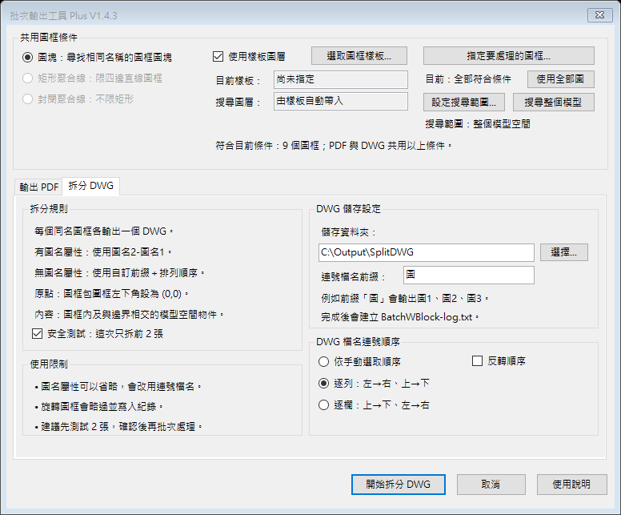

# BatchPlotPlus

BatchPlotPlus 是供 AutoCAD 2021–2025（Windows 64 位元）使用的繁體中文批次出圖工具。目前版本為 **1.4.3**。

它把「批次輸出多頁 PDF」與「依圖框拆分 DWG」整合在同一個視窗與 Ribbon 頁籤，並以不儲存來源圖面變更為原則執行暫時性出圖處理。





## 主要功能

- 依同名圖框、矩形聚合線或封閉聚合線尋找圖紙範圍。
- 將全部圖框輸出為一份多頁 PDF，或分別輸出單頁 PDF。
- 自動符合紙張、置中，並可選擇自動、橫向或直向紙張方向。
- 出圖樣式之外，可獨立開啟或關閉物件線粗與透明度列印。
- 依目前 DWG 模式限制出圖樣式：CTB 圖面只顯示 CTB，STB 圖面只顯示 STB。
- 使用 `monochrome` 時，在未提交的 AutoCAD transaction 中暫時處理 True Color／命名樣式顏色，出圖後回復。
- 依圖框批次拆分 DWG，並提供先測試前 2 張的安全選項。
- 自動載入「批次輸出工具」Ribbon 頁籤。

## 1.4.3 更新

- 新增「列印物件線粗」與「列印物件透明度」開關，並直接對應 AutoCAD 出圖設定。
- 新增自動、橫向、直向三種圖紙方向，保留另外旋轉 180° 與圖框置中。
- PDF 與 DWG 排序狀態已分離，切換頁籤不會互相覆寫。
- 安裝器改為 PowerShell 主體、BAT 入口，修正括號、`&`、中文與 `!` 路徑解析、UAC 等待與退出碼傳遞。
- 改部署到 `%ProgramData%\Autodesk\ApplicationPlugins`，並在備份後清除指向舊路徑的 Loader 登錄。
- 安裝成功僅代表靜態部署驗證通過；AutoCAD 執行期載入需由 `BATCHPLOTDIAG` 再確認。

> 版本號依專案要求收斂為 1.4.3；本版取代之前標示為 1.4.21 的安裝包。

## 1.4.21 更新

- 安裝程式會逐一解除並檢查來源、暫存及部署後 bundle 內所有檔案的 `Zone.Identifier`。
- 任一檔案無法解除封鎖或仍保留下載封鎖標記時，安裝立即失敗，不再只顯示警告或回報部署成功。
- 部署後封鎖檢查或 DLL 完整性檢查失敗時，會移除無效的新版本並嘗試還原舊版。
- 安裝診斷改為掃描 bundle 內全部檔案；任何被封鎖檔案均列為失敗。

## 1.4.2 更新

- 修正部分電腦安裝後沒有 Ribbon 頁籤、按鈕與指令的問題。
- 安裝位置改為 AutoCAD 隱含信任的 `%ProgramFiles%\Autodesk\ApplicationPlugins`，安裝程式會自動要求系統管理員權限。
- 修正 bundle 的啟動載入與指令觸發載入設定；即使 Ribbon 初始化失敗，備用指令仍可使用。
- 新增 `BATCHPLOTDIAG` 執行期診斷指令，以及 `DiagnoseInstallation.bat` 一鍵安裝診斷報告。
- 安裝時會解除下載檔案封鎖，並移除同名的舊版使用者／共用安裝，避免 AutoCAD 載入錯誤副本。

完整版本紀錄請見 [CHANGELOG.md](CHANGELOG.md)。

## 1.4.1 更新

- 有完整「圖名1／圖名2」屬性時，繼續使用 圖名2-圖名1 命名。
- 圖框屬性不足或沒有屬性時，可使用自訂前綴和排序後連號，例如 圖1.dwg、圖2.dwg、圖3.dwg。
- DWG 頁籤可獨立設定手動選取、逐列、逐欄及反轉順序。

## 安裝

一般使用者不需要 Visual Studio 或 .NET SDK：

1. 從 [GitHub Releases](https://github.com/NicheSam/BatchPlotPlus/releases/latest) 下載 `BatchPlotPlus-1.4.3-installer.zip`。
2. 解壓縮全部內容。
3. 完整關閉 AutoCAD。
4. 雙擊 `InstallOrUpdate.bat`。
5. 重新開啟 AutoCAD，使用「批次輸出工具」頁籤。

備用指令：

| 指令 | 功能 |
| --- | --- |
| `BATCHPLOTPLUS` | 開啟上次使用的功能頁面 |
| `BATCHPDF` | 開啟 PDF 輸出頁面 |
| `BATCHWB` | 開啟 DWG 拆分頁面 |
| `BATCHPLOTDIAG` | 顯示目前載入的 DLL、版本及 AutoCAD 載入設定 |

部署位置：

```text
%ProgramData%\Autodesk\ApplicationPlugins\BatchPlotPlus.bundle
```

安裝程式不會強制關閉 AutoCAD；若偵測到 AutoCAD 正在執行，會停止部署。若安裝後仍未載入，請先執行解壓縮資料夾內的 `DiagnoseInstallation.bat`，再將桌面產生的診斷報告提供給維護者。

## 建置

需求：

- Windows 10／11 64 位元
- .NET 8 SDK
- Windows 上的 .NET Framework 4.8 targeting pack
- 建置時會從 Autodesk 官方 NuGet 套件取得 AutoCAD 2021 與 2025 API 編譯參考

```powershell
powershell.exe -NoProfile -ExecutionPolicy Bypass -File .\BuildRelease.ps1
```

`BuildRelease.ps1` 會建立 AutoCAD 2021–2024 使用的 .NET Framework 4.8 組件、AutoCAD 2025 使用的 .NET 8 組件，執行測試與 bundle 驗證，再產生 release 壓縮檔。

## 專案結構

```text
BatchPlotPlus.AutoCAD/  AutoCAD .NET 插件原始碼
Bundle/                 ApplicationPlugins bundle manifest 與說明
LogicTests/             不需要 AutoCAD 的純邏輯回歸測試
UiPreview/              離線 WinForms 介面預覽
docs/                   控制項行為與介面用語檢視
tools/                  bundle 與載入驗證工具
ui-preview/             PDF／DWG 頁籤畫面
```

## 驗證狀態

1.4.3 已通過：

- `net48` 與 `net8.0-windows` Release 建置：0 warnings、0 errors。
- 31 項純邏輯測試。
- 全域 UI 控制項→狀態→後端消費者契約測試。
- 安裝器在空格、括號、`&`、中文、`!` 五種路徑的非部署沙盒測試。
- 安裝檔缺失時回傳非零退出碼與明確錯誤訊息。
- 安裝位置、manifest 載入旗標、指令宣告與診斷檔封裝契約測試。
- 實際建立 `Zone.Identifier` 的負向測試：未修復時安裝驗證失敗，逐檔解除後無殘留標記。
- R24／R25 bundle 路由、目標框架、DLL 與封裝結構驗證。
- AutoCAD 2023 Core Console 實際 NETLOAD R24 組件。
- PDF／DWG 兩頁繁體中文 WinForms 離線介面回歸。
- AutoCAD CTB 三頁黑白 PDF 測試：三頁彩色像素皆為 0。
- 實際 14 MB DWG 副本單頁輸出：彩色像素為 0。
- 暫時性顏色處理前後物件狀態數量一致，未儲存來源 DWG 變更。

## 限制與安全注意事項

- 每頁仍由 AutoCAD 原生出圖引擎產生；大量圖框本來就需要逐頁圖形生成時間。
- 缺少 SHX、外部參考或出圖裝置時，應先修復來源圖面的依賴項目。
- DWG 拆分會建立新檔，不應刪除來源物件；第一次使用新圖面時，建議保留「先測試前 2 張」。
- 本 repository 尚未指定開源授權；未經另外授權，不代表可任意重新散布或修改。

## English

BatchPlotPlus 1.4.3 is a Traditional Chinese plug-in for AutoCAD 2021–2025 on 64-bit Windows. It provides a Ribbon tab and a two-tab WinForms interface for native multi-page PDF output and copy-safe DWG splitting. The bundle automatically loads a .NET Framework 4.8 assembly on AutoCAD 2021–2024 and a .NET 8 assembly on AutoCAD 2025.

Version 1.4.3 adds independent lineweight and transparency output switches, explicit page orientation, safer ProgramData deployment, stale Loader cleanup, special-character path handling, and truthful UAC exit-code propagation. The 1.4.3 numbering supersedes the earlier 1.4.21 package label.

Download the installer package from [GitHub Releases](https://github.com/NicheSam/BatchPlotPlus/releases/latest), extract it, close AutoCAD, and run `InstallOrUpdate.bat`. AutoCAD 2021 and 2025 should still receive version-specific runtime smoke testing because those hosts are not installed in the current development environment.
